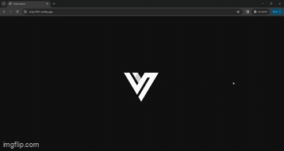

# Personal Portfolio

Welcome to my personal portfolio repository! This repository contains the source code for my personal portfolio website.

## Demo



## Introduction

This repository hosts the code for my personal portfolio website, which is built using React. It showcases my projects, skills, experiences, and education. Feel free to explore the codebase and provide any feedback or suggestions.

## Features

- **Responsive Design**: The portfolio website is designed to be responsive, ensuring optimal viewing experience across various devices.
- **Sections**: The website is divided into several sections including home, education, experience, skills, and projects, allowing visitors to easily navigate and explore.
- **Dynamic Content**: Content in each section is dynamically generated using React components, making it easy to update and maintain.
- **Cool Animations**: The website features engaging animations to enhance user experience and add visual appeal.

# Running the Personal Portfolio Locally

To run this project locally, follow these steps:

1. Clone this repository to your local machine using:
   ```bash
   git clone https://github.com/Vickykumar1001/Personal-Portfolio.git
   ```
2. Navigate to the project directory:
   ```bash
   cd Personal-Portfolio
   ```
3. Install dependencies using npm:
   ```bash
   npm install
   ```
4. Start the development server:
   ```bash
   npm start
   ```

## Usage

Feel free to use this project as a template for your own personal portfolio website. Customize it to your liking by modifying the React components, styling, and content. Add your own projects, skills, experiences, and education to showcase your abilities effectively.

```

```
